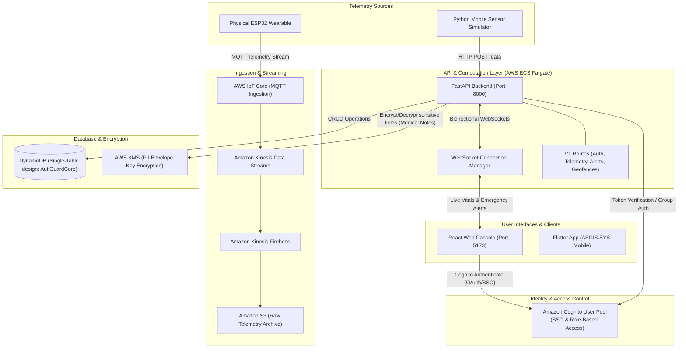

# 🛡️ AutiGuard & AEGIS.SYS: Cloud-Native Safety & Caregiver Command Console

[](https://aws.amazon.com/)
[](https://react.dev/)
[](https://fastapi.tiangolo.com/)
[](https://rancherdesktop.io/)

AutiGuard is a premium, cloud-native safety and emotional monitoring platform designed to protect wearers and assist caregivers. Integrating live wearable telemetry, secure cloud infrastructure, and a premium glassmorphic control dashboard, the platform provides real-time distress detection, geofencing safety zones, and secure health profile management.

**AEGIS.SYS** (the local hardware/simulation system) drives the critical telemetry simulation, physical sensor logic (like fall detection, audio distress thresholds), and local dev-servers.

---

## 🏗️ Detailed Architecture & Data Flow

Below is the end-to-end architecture detailing telemetry ingestion, real-time communication via WebSockets, security encryption via AWS KMS, and user access control via AWS Cognito.



---

## 🛠️ Unified Technology Stack

| Layer | Component | Description |
| :--- | :--- | :--- |
| **Frontend** | React 18 (Vite) | Main Caregiver Console featuring TailwindCSS, Zustand state manager, Leaflet maps, and Recharts. |
| **Mobile** | Flutter 3.0+ | Cross-platform caregiver app with integrated Google Maps and custom warning sheets. |
| **Backend** | FastAPI (Python 3.11) | High-performance API using Pydantic v2, PyJWT, Boto3, and WebSockets. |
| **Database** | Amazon DynamoDB | Primary single-table schema for O(1) performance. Local SQLite database (`wearable.db`) for offline testing. |
| **Security** | AWS KMS & Cognito | Secure role-based access control (RBAC) and field-level envelope encryption for PII. |
| **Infrastructure** | AWS CDK | TypeScript-based Infrastructure as Code (IaC) deployment definitions. |

---

## ⚡ Core Features & Security Guardrails

### 🔒 Enterprise Cloud Security
* **Cognito-Powered RBAC**: Caregivers and administrators are authenticated via Cognito User Pools. Roles (`org_admin`, `caregiver`) are checked against decoded JWT groups to restrict system endpoints.
* **PII Envelope Encryption (AWS KMS)**: HIPAA-compliant data security. Sensitive wearer files like `medical_notes`, `allergies`, and `medications` are encrypted in transit using AWS KMS envelope keys before being persisted in DynamoDB.
* **Optimized DynamoDB Schema**: Utilizing a single-table design for quick index query lookups without database table joins.

### 🚨 AEGIS.SYS Precision Logic
* **Data Freshness validation**: Triggers a `"NOT CONNECTED"` warning state on the frontend dashboard if client heartbeat signals or telemetry data packages pause for more than 5 seconds.
* **Intelligent Fall Filtering**: Avoids false alarms by checking acceleration data for sustained impact. Alerts trigger only when 2 consecutive sensor packets exceed **25.0 m/s²**.
* **30% Liquid Glass Sheets**: Non-intrusive overlays covering exactly 30% of the screen height, paired with Text-to-Speech (TTS) safety announcements.
* **Smart Geofence Violation**: Immediate alert triggers when wearer device moves outside of the set 100m safe zone.

---

## 📁 Clean Repository Structure

```
├── backend/
│   ├── app/
│   │   ├── api/v1/       # Auth, wearers, telemetry, alerts, geofence, comms router
│   │   ├── core/         # Config settings, KMS security, DynamoDB wrapper
│   │   └── main.py       # FastAPI startup and WebSocket manager
│   ├── Dockerfile
│   └── requirements.txt
├── frontend/
│   ├── src/              # React components, stores, maps, pages
│   │   ├── components/   # Reuseable visual components (Map, navbar, sidebar, alert feeds)
│   │   ├── pages/        # Router pages (Dashboard, Settings, Profile, QR-view)
│   │   ├── store/        # Zustand state stores
│   │   └── aws-config.ts # AWS client configurations
│   ├── Dockerfile
│   └── package.json
├── infra/
│   ├── lib/              # AWS CDK Stacks (Compute, Database, Auth, Security)
│   └── tsconfig.json
├── autiguard_app/        # Flutter Client Application (AEGIS.SYS Mobile)
├── sensor logger/        # Hardware telemetry loggers & local server setup
│   └── ai-wearable/
├── assets/               # Production screenshots and graphics
├── Hardware-main.zip     # Source code backup for the physical wearable hardware
└── docker-compose.yml    # Main orchestration docker compose config
```

---

## 🚀 Execution & Local Setup

### 1. Web Console & FastAPI Server Setup

#### Local Configuration (`backend/.env`)
Create the environment variables in `backend/.env`:
```env
AWS_DEFAULT_REGION=ap-south-1
AWS_ACCESS_KEY_ID=YOUR_AWS_ACCESS_KEY_ID
AWS_SECRET_ACCESS_KEY=YOUR_AWS_SECRET_ACCESS_KEY
DYNAMODB_TABLE=AutiGuardCore
COGNITO_USER_POOL_ID=ap-south-1_n9TxDAu3z
COGNITO_CLIENT_ID=3qu3kqqt4beqo1p6r02f8l1c09
KMS_KEY_ID=9d4d41d7-bf21-45b4-aae2-8f57d55c522e
MOCK_AWS=False
```

#### Run Without Containers
```bash
# Start backend
cd backend
python -m venv venv
venv\Scripts\activate # source venv/bin/activate on Unix
pip install -r requirements.txt
python -m uvicorn app.main:app --reload

# Start frontend
cd ../frontend
npm install
npm run dev
```

#### Run Containerized (Docker / Rancher Desktop)
```bash
# Build and run the app
docker compose up --build -d
```
Access the client dashboard at **`http://localhost:5173/`**.

---

### 2. AEGIS.SYS Local Hardware/Sim Setup

#### Local Environment Setup
Configure your settings:
```bash
LAPTOP_IP=10.123.50.141
HARDWARE_DB_PATH=E:/Athidh/Autiguard/esp32-cloud-server-main/wearable.db
GOOGLE_MAPS_API_KEY=YOUR_GOOGLE_MAPS_API_KEY
```

#### Run Backend Server (With SQLite)
```bash
cd "sensor logger/ai-wearable/backend"
python main.py
```

#### Run Mobile Data Simulator
```bash
python mobile_data_simulator.py
```

#### Run Flutter Client App
```bash
cd autiguard_app
flutter run
```

---

## 🚨 Alert Ingestion Rules

| Alert Type | Trigger Threshold | Client UI Actions |
| :--- | :--- | :--- |
| **Fall Detection** | Acceleration > 25.0 m/s² (2 consecutive packets) | Flashes red emergency screen, overlays alert sheet |
| **High Noise** | Decibels > 85.0 dB | Triggers Text-to-Speech alert warning caregiver |
| **Geofence Breach** | Wearer distance > 100m from safe zone center | Sounds warning chime, shows wearer position on map |
| **Panic / SOS** | Wearer device button press | Plays high priority alert, overlays active distress beacon |

---

## 🏆 Console Verification

The caregiver console has been verified against the live AWS environment. Below is the active view showing the Leaflet mapping tracker, real-time stress index monitoring, and an active sound level distress incident:


---

**AEGIS.SYS Mission Status**: ✅ **COMPLETE & OPERATIONAL**  
**Ready for**: Hackathon demonstration, live safety monitoring, real-world deployment.
