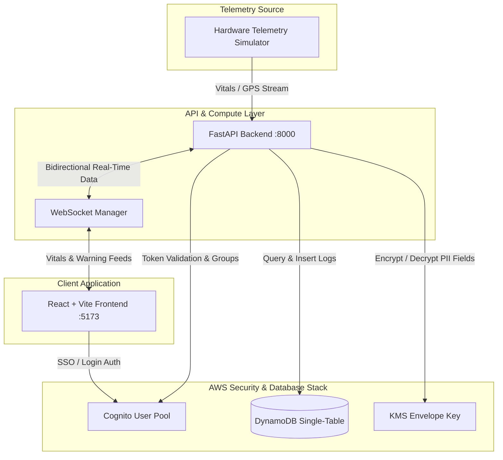

# 🛡️ AutiGuard: Cloud-Native AI Safety & Emotional Monitoring Caregiver Console

[](https://aws.amazon.com/)
[](https://react.dev/)
[](https://fastapi.tiangolo.com/)
[](https://rancherdesktop.io/)
[](https://aws.amazon.com/kms/)

AutiGuard is a cloud-native, real-time safety and emotional monitoring platform designed to protect wearers and assist caregivers. Integrating live wearable telemetry, secure cloud infrastructure, and a premium glassmorphic control dashboard, the platform provides real-time distress detection, geofencing safety zones, and secure health profile management.

---

## 🏗️ Architecture & Data Flow



### Deployed AWS Services
| Concern | AWS Service |
| :--- | :--- |
| **Device Ingestion** | AWS IoT Core (MQTT topics per device) |
| **Stream Processing** | Amazon Kinesis Data Streams + Firehose (raw archive to S3) |
| **Event-Driven Compute** | AWS Lambda (geofence checks, fall detection, alert dispatch) |
| **ML Model Hosting** | Amazon SageMaker (real-time endpoints) |
| **Primary Data Store** | Amazon DynamoDB (single-table design) |
| **Object Storage** | Amazon S3 (audio embeddings, reports, QR images) |
| **Auth** | Amazon Cognito (User Pools + Identity Pools, RBAC) |
| **API Layer** | Amazon API Gateway (REST + WebSocket) fronting FastAPI on ECS Fargate |
| **Secrets & Encryption** | AWS KMS + AWS Secrets Manager |
| **CDN / Hosting** | Amazon CloudFront + AWS Amplify Hosting |
| **IaC** | AWS CDK (TypeScript) |

---

## 🛠️ Tech Stack

| Layer | Technology |
| :--- | :--- |
| **Frontend** | React 18 (Vite), TypeScript, TailwindCSS, React Query, Zustand, Leaflet Maps, Recharts |
| **Backend** | FastAPI (Python 3.11), Pydantic v2, PyJWT, Boto3, Uvicorn |
| **Database** | Amazon DynamoDB (primary single-table design) |
| **Containerization** | Docker, Docker Compose, Rancher Desktop (`nerdctl`) |
| **Infrastructure** | AWS CDK (TypeScript) |

---

## ⚡ Core Features & Security Implementations

* **Cognito-Powered RBAC**: Secure single sign-on (SSO) utilizing Cognito credentials flow. Roles (`org_admin`, `caregiver`) are checked against Cognito User Groups and decoded securely on the backend to enforce permission guards.
* **PII Envelope Encryption (AWS KMS)**: Sensitive wearer fields like `medical_notes`, `allergies`, and `medications` are encrypted on the backend using AWS KMS prior to DynamoDB persistence and decrypted on-the-fly only when requested by verified caregivers.
* **DynamoDB Single-Table Design**: High-efficiency schema optimization utilizing partition keys (`PK`), sort keys (`SK`), and a Global Secondary Index (`GSI1`) for O(1) retrieval of wearer profiles, telemetry, geofences, and alarms.
* **Real-Time WebSockets**: Live vitals (Heart Rate, Stress Index) and warnings are pushed dynamically to connected clients.
* **Liquid Glass Emergency Overlays**: Visually stunning dashboard alerting caregivers of critical incidents (falls, loud environments, geofence breaches) within a 30% screen sheet containing Text-to-Speech (TTS) emergency warnings.

---

## 📊 Single-Table Data Model

Table Name: `AutiGuardCore`

| PK | SK | Entity | Attributes / Notes |
| :--- | :--- | :--- | :--- |
| `ORG#<orgId>` | `PROFILE` | Organization | Name, plan tier |
| `ORG#<orgId>` | `USER#<userId>` | Caregiver/Admin | Role, email, name |
| `WEARER#<wearerId>` | `PROFILE` | Wearer Profile | Name, DOB, encrypted medical notes, contacts |
| `WEARER#<wearerId>` | `TELEMETRY#<ISO8601>` | Telemetry logs | Heart rate, GPS coordinates, stress index, battery |
| `WEARER#<wearerId>` | `ALERT#<ISO8601>` | Alert event | Incident type, severity, acknowledgment status |
| `WEARER#<wearerId>` | `GEOFENCE#<fenceId>` | Geofence safe area| Coordinates, radius, state |

* **GSI1** Partition Key: `GSI1PK = WEARER#<wearerId>`, Sort Key: `GSI1SK = ALERT#<timestamp>` for querying historical wearer incidents efficiently.

---

## 📁 Repository Structure

```
├── backend/
│   ├── app/
│   │   ├── api/v1/       # Auth, wearers, telemetry, alerts, geofence, comms router
│   │   ├── core/         # Config settings, KMS security, DynamoDB wrapper
│   │   └── main.py       # FastAPI startup and WebSocket manager
│   ├── Dockerfile
│   └── requirements.txt
├── frontend/
│   ├── src/              # React components, stores, maps, pages
│   ├── Dockerfile
│   └── package.json
├── infra/
│   ├── lib/              # AWS CDK Stacks (Compute, Database, Auth, Security)
│   └── tsconfig.json
├── assets/               # Production screenshots and graphics
└── docker-compose.yml    # Main orchestration docker compose config
```

---

## 🚀 Deployment & Local Setup

### 1. Local Configuration
Configure the environment variables in `backend/.env`:
```env
AWS_DEFAULT_REGION=ap-south-1
AWS_ACCESS_KEY_ID=YOUR_AWS_ACCESS_KEY_ID
AWS_SECRET_ACCESS_KEY=YOUR_AWS_SECRET_ACCESS_KEY
DYNAMODB_TABLE=AutiGuardCore
COGNITO_USER_POOL_ID=ap-south-1_n9TxDAu3z
COGNITO_CLIENT_ID=3qu3kqqt4beqo1p6r02f8l1c09
KMS_KEY_ID=9d4d41d7-bf21-45b4-aae2-8f57d55c522e
MOCK_AWS=False
```

### 2. Run Locally (Without Containers)
```bash
# Start backend
cd backend
python -m venv venv
venv\Scripts\activate # source venv/bin/activate on Unix
pip install -r requirements.txt
python -m uvicorn app.main:app --reload

# Start frontend
cd ../frontend
npm install
npm run dev
```

### 3. Run Containerized (Docker & Rancher Desktop)
Spin up both the React client and FastAPI server inside connected containers:
```bash
# Using Docker
docker compose up --build -d

# Using Rancher Desktop (containerd runtime)
nerdctl compose up --build -d
```
Access the client dashboard at **`http://localhost:5173/`**.

### 4. Deploy to Rancher Kubernetes
Apply configurations to your local Rancher Kubernetes cluster:
```bash
# Build images in the local Kubernetes namespace
nerdctl --namespace k8s.io build -t autiguard-backend:latest ./backend
nerdctl --namespace k8s.io build -t autiguard-frontend:latest ./frontend

# Deploy manifests
kubectl apply -f kubernetes-deployment.yaml
```

---

## 🏆 Verified Console Dashboard UI

The caregiver console has been verified against the live AWS environment. Below is the active view showing the Leaflet mapping tracker, real-time stress index monitoring, and an active sound level distress incident:


