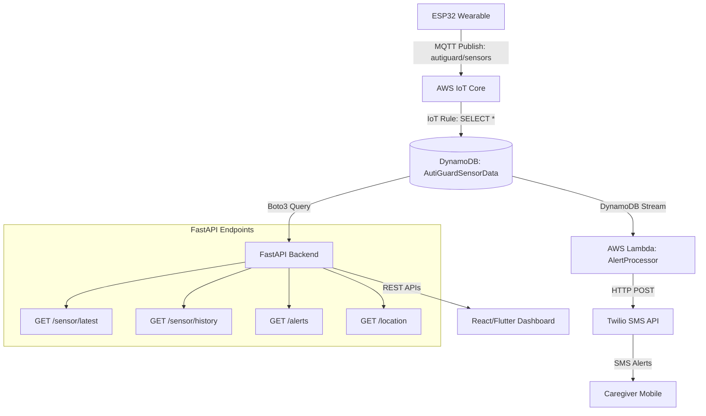

# AutiGuard Hardware Integration Architecture & Deployment

## 1. System Architecture Diagram



## 2. Prerequisites
1. **AWS CLI:** Installed and configured with appropriate permissions.
2. **Twilio Account:** Account SID, Auth Token, and a Twilio phone number.
3. **Python 3.11+:** For packaging the Lambda function.

## 3. Deployment Steps

### Step 1: Package the Lambda Function
The Lambda function relies on external libraries (like `twilio`). You need to package it before deploying.

```bash
cd aws/lambda
# Create a deployment directory
mkdir package
# Install dependencies into the directory
pip install -r requirements.txt -t package/
# Copy the lambda code
cp alert_processor.py package/
# Create the deployment zip
cd package
zip -r ../alert_processor.zip .
cd ..
# Clean up
rm -rf package
```

### Step 2: Deploy the CloudFormation Stack
Use the AWS CLI to deploy the infrastructure. Replace the parameter values with your actual Twilio credentials and caregiver phone number.

```bash
aws cloudformation deploy \
  --template-file aws-iot-infrastructure.yaml \
  --stack-name AutiGuardIoTStack \
  --capabilities CAPABILITY_NAMED_IAM \
  --parameter-overrides \
      TwilioAccountSid=YOUR_ACCOUNT_SID \
      TwilioAuthToken=YOUR_AUTH_TOKEN \
      TwilioFromNumber=YOUR_TWILIO_NUMBER \
      CaregiverPhoneNumber=YOUR_CAREGIVER_NUMBER
```

### Step 3: Update the Lambda Function Code
The CloudFormation template provisions a placeholder Lambda function. Update it with the zip file you created in Step 1.

```bash
# Get the Lambda function name from CloudFormation outputs (typically AutiGuardAlertProcessor)
aws lambda update-function-code \
  --function-name AutiGuardAlertProcessor \
  --zip-file fileb://alert_processor.zip
```

### Step 4: Configure the ESP32
Configure your ESP32 hardware to connect to AWS IoT Core and publish MQTT payloads to the `autiguard/sensors` topic. Ensure the payload structure matches the required JSON format:
```json
{
  "device_id": "autiguard001",
  "timestamp": 1753087200,
  "heart_rate": 82,
  "stress_score": 35,
  "latitude": 11.9416,
  "longitude": 79.8083,
  "fall_detected": false,
  "sound_alert": false
}
```

### Step 5: Start the Backend Server
Start your FastAPI backend to serve the new endpoints.

```bash
cd backend
# Ensure requirements are met
pip install -r requirements.txt boto3
# Run the server
uvicorn app.main:app --reload
```

## 4. API Usage

You can test the newly integrated endpoints using `curl` or Postman.

- **Latest Sensor Reading:**
  ```bash
  curl http://localhost:8000/api/v1/sensor/latest?device_id=autiguard001
  ```
- **Sensor History:**
  ```bash
  curl http://localhost:8000/api/v1/sensor/history?device_id=autiguard001&limit=10
  ```
- **Alert History:**
  ```bash
  curl http://localhost:8000/api/v1/alerts?device_id=autiguard001
  ```
- **Latest Location:**
  ```bash
  curl http://localhost:8000/api/v1/location?device_id=autiguard001
  ```
